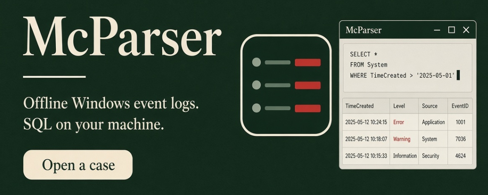

# McParser



McParser is for the host you cannot put an agent on. A one-shot collector zip, or a copied `.evtx`, leaves on a USB. The analysis runs on your Mac, Windows machine, or Ubuntu box, off the plant network. The case stays a folder on that machine. SQL runs locally. Notes, hunts, the run trail, and the chat transcript travel with the case. The API key does not.

A case can hold more than one host. Event logs, Prefetch, Amcache, Shimcache, UserAssist, SRUM, services, and scheduled tasks sit on one timeline, keyed by host. You query them with the same SQL, mark a row, and hand the folder to the next analyst as an encrypted `.mcpz`.

What is next: [McParser project](https://github.com/users/danieldejager/projects/2/views/1). The manual is [docs/manual](docs/manual/README.md).

## Built

- Open an offline `.evtx` and query it with SQL. `event_data` is JSON, so a field such as `TargetUserName` is filterable.
- Import a Velociraptor offline collector zip. Hosts are keyed by HostID, collections by session id.
- Prefetch, shimcache, SRUM, services, scheduled tasks, UserAssist, and Amcache load beside the events. A second import of the same zip skips what is already recorded.
- Stats, saved queries, and MITRE hunts. Results export as a table, CSV, or JSONL.
- A note on a row, and a run trail with a label and the previous run.
- Ask Grok, Claude, or OpenAI about the case. The key stays in the OS keychain. The question, the SELECT, and the answer stay in the case.
- File → Export handoff writes an encrypted `.mcpz`. The key is not in the file.
- Installers for macOS, Windows ARM64, and Ubuntu amd64 and arm64, built when a version tag is pushed.

## Install

Download the package for your machine from the [releases page](https://github.com/danieldejager/mcparser/releases). A Mac disk image, a Windows ARM setup, and Ubuntu packages for amd64 and arm64 are built when a version tag is pushed.

The Mac image is unsigned. A download from the browser is marked, and Gatekeeper then says the app is damaged. That is the missing signature, not a broken disk image. Clear the mark and open it:

```bash
xattr -cr /Applications/McParser.app
open /Applications/McParser.app
```

Signing and notarisation wait until the product is ready. The Windows setup is ARM64. It is not an Intel build. The packages are built by GitHub Actions when a `v*` tag is pushed.

## The window

File, then Open EVTX. Pick a log. McParser creates `<file>.mcp` beside it and ingests the file. That folder is the case. It holds `events.duckdb` and `catalog.sqlite`. Copy the folder and the other analyst has the same case.

The left pane collapses.

**Case.** Path, file name, size, SHA-256, event count, unique event ids, time range, channels, and providers. Refresh case reads the folder again. Analyst is the name written on the next run.

**Queries.** Save query asks for a name. A click loads that SQL into the editor. Run executes it.

**Hunts.** Choose a MITRE tactic, then a technique. A click loads that hunt. The first set is successful logon, network logon, failed logon, explicit credentials, account created, account changed, special privileges, and one account. One account still says `USER`. Replace it before Run.

The editor shows line numbers. Run sends the SQL to the case. Export CSV writes the current grid, including the column names. Click a result row whose query includes `record_id` to write a note.

**Audit.** Notes lists every note. Runs lists every successful Run: the SQL, the time, the row count, the hunt label, the previous run, the analyst, and whether it was a replay. A click there loads the SQL and marks the next run as a replay. Trail puts notes and runs on one list. Export trail writes `trail.csv`.

**AI Model.** The dropdown is Grok, Claude, or OpenAI. AI Integration, then Connect, saves that vendor's key. The key is encrypted with the macOS keychain or Windows DPAPI. It is not stored in the case. A vendor with no key says `Configure this integration` and no request is sent.

Ask writes one SELECT, runs it, and shows the answer beside the SQL. The first ask in a session asks you to confirm that row text will leave the machine. The `.evtx` file and the DuckDB file stay here. The reply is prefixed with the vendor. A completed ask is stored in the case. Open the case again and the question, the SELECT, and the answer are already in the pane. The other machine can read that transcript. It needs its own key to ask again.

## The command line

The app is the usual way in. The `mcparser` binary is the same parser.

```bash
mcparser collect --case Emerio7.mcp /path/to/collector.zip
mcparser hosts --case Emerio7.mcp
mcparser query --case Emerio7.mcp \
  "SELECT executable, run_count FROM prefetch ORDER BY run_count DESC LIMIT 20"
mcparser ingest --case case.mcp Security.evtx System.evtx
mcparser stats --case case.mcp
mcparser query --case case.mcp \
  "SELECT event_id, count(*) FROM events GROUP BY event_id ORDER BY event_id"
mcparser query --case case.mcp --format csv \
  "SELECT time_created, event_id, json_extract_string(event_data, '$.TargetUserName') FROM events WHERE event_id = 4624 LIMIT 20"
mcparser save-query --case case.mcp --name fsir \
  "SELECT event_id, count(*) FROM events WHERE json_extract_string(event_data, '$.TargetUserName') = 'fsir' GROUP BY event_id"
mcparser queries --case case.mcp
mcparser save-note --case case.mcp --record 51 "fsir account created, start of the trail"
mcparser notes --case case.mcp
mcparser runs --case case.mcp
mcparser chats --case case.mcp
```

`--format` is `table`, `csv`, or `jsonl`. CSV includes a header row. Run these from the directory that contains `case.mcp`, or pass a full path. A relative path is resolved from the current directory.

A second ingest of the same bytes is skipped. The same path with a new hash replaces the old rows.

Columns are `source_sha256`, `record_id`, `event_id`, `channel`, `provider`, `computer`, `time_created`, and `event_data`. `event_data` is JSON. Filter a field with `json_extract_string(event_data, '$.TargetUserName')`.

A command-line query is not a run. Only the Run button writes the trail. A failed ask is not stored.

## Build from source

You need Rust. DuckDB and SQLite are compiled into the binary. Do not install them separately.

```bash
git clone https://github.com/danieldejager/mcparser.git
cd mcparser
cargo build --release
cd ui
npm install
npm start
```

The first build compiles DuckDB and can take several minutes. On Windows ARM, use the ARM64 developer shell so `link.exe` is the ARM64 linker.

Do not commit a case, `node_modules`, or `ui/dist`.

 

 

Author: Daniel de Jager. https://github.com/danieldejager/mcparser

Licence: free for personal and non-profit use. A for-profit company, paid work, or a paid product needs a commercial licence. See [LICENSE](LICENSE).
