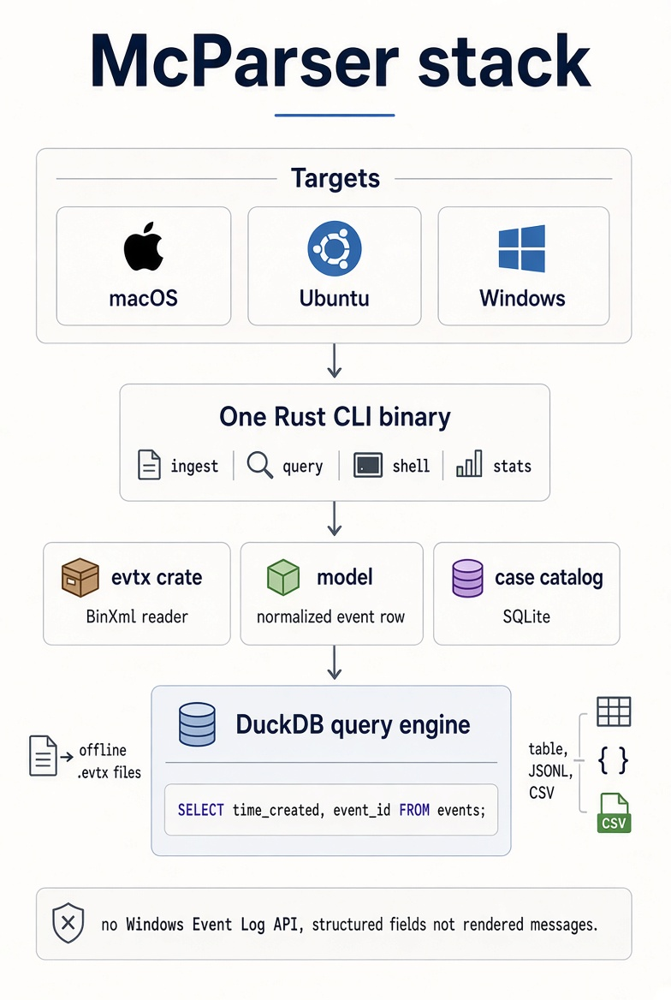

# McParser

Offline Windows event log parser. Point it at `.evtx` files and query them with SQL. No Windows Event Log API, so the same tool runs on macOS, Ubuntu, and Windows.

Current release: **0.2.0**, on the `ai-integration` branch. The chat is not in the 0.1.0 installers. Downloads for 0.1.0: https://github.com/danieldejager/mcparser/releases/tag/v0.1.0

What is next: [ROADMAP.md](ROADMAP.md). Chat design: [docs/grok-chat.md](docs/grok-chat.md).



## Install

### macOS app

Download `McParser-0.1.0-arm64.dmg` from the release. Open it and drag McParser to Applications. The image is unsigned, so Gatekeeper will warn. Right-click McParser and choose Open. That build does not include Grok chat.

File → Open EVTX creates a case beside the log and ingests it. The default `fixtures` path is only for a source checkout.

### Windows app

Download `McParser Setup 0.1.0.exe` from the release. This installer is ARM64. It runs on Windows 11 on Apple silicon. It is not an Intel build. That build does not include Grok chat.

### From source

You need a Rust toolchain. DuckDB and SQLite are compiled into the binary. Do not install them separately. The first build compiles DuckDB and can take several minutes.

macOS, with Homebrew:

```bash
git clone https://github.com/danieldejager/mcparser.git
cd mcparser
brew install rust
cargo build --release
cp target/release/mcparser /usr/local/bin/mcparser
```

Ubuntu:

```bash
git clone https://github.com/danieldejager/mcparser.git
cd mcparser
curl --proto '=https' --tlsv1.2 -sSf https://sh.rustup.rs | sh
source "$HOME/.cargo/env"
cargo build --release
```

Windows ARM64: install Rust from https://rustup.rs and the Visual Studio 2022 Build Tools with the ARM64 C++ workload. In the Developer PowerShell for VS 2022:

```powershell
cargo build --release
```

The binary is `target\release\mcparser.exe`.

## Desktop

The app is an Electron shell around the parser. From a source checkout of `ai-integration`:

```bash
cargo build -p mcparser
cd ui
npm install
npm start
```

File → Open EVTX creates `<file>.mcp` next to the log. The case pane shows file name, size, SHA-256, event count, unique event ids, time range, channels, and providers. Run SQL in the editor. Export CSV writes the current grid, including the column names.

Grok, then Connect Grok, takes an xAI key. The key is encrypted with the macOS keychain or Windows DPAPI. Ask writes one SELECT, McParser runs it on the open case, and the answer is shown beside the SQL. The case file is not sent.

## CLI

```bash
mcparser ingest --case case.mcp Security.evtx System.evtx
mcparser stats --case case.mcp
mcparser query --case case.mcp \
  "SELECT event_id, count(*) FROM events GROUP BY event_id ORDER BY event_id"
mcparser query --case case.mcp --format csv \
  "SELECT time_created, event_id, json_extract_string(event_data, '$.TargetUserName') FROM events WHERE event_id = 4624 LIMIT 20"
```

`--format` is `table` (default), `csv`, or `jsonl`. CSV includes a header row.

A case directory contains `events.duckdb` and `catalog.sqlite`. Do not commit it. Ingest skips a file whose bytes are already in the catalog. The same path with a new hash replaces the old rows.

Columns are `source_sha256`, `record_id`, `event_id`, `channel`, `provider`, `computer`, `time_created`, and `event_data`. `event_data` is JSON. Filter a field with `json_extract_string(event_data, '$.TargetUserName')`.

## What 0.2.0 does not do

Rendered message text is not in the `.evtx` file. It lives in the provider DLL, so 0.2.0 does not produce the English sentence. There is no shell and no saved queries. The macOS image is not notarised. The Windows installer is ARM64 only. There is no Ubuntu package. The 0.1.0 installers do not include the chat.

## Stack

| Layer | Choice |
| --- | --- |
| Language | Rust parser, Electron desktop shell |
| Reader | `evtx` crate |
| Query | DuckDB |
| Catalog | SQLite |
| Commands | `ingest`, `query`, `stats` |
| Desktop | Electron, in `ui/` |
| Chat | xAI API, key in the OS keychain |

```text
crates/evtx-read
crates/model
crates/case
crates/query
crates/cli
ui/
```

Author: Daniel de Jager. https://github.com/danieldejager/mcparser
