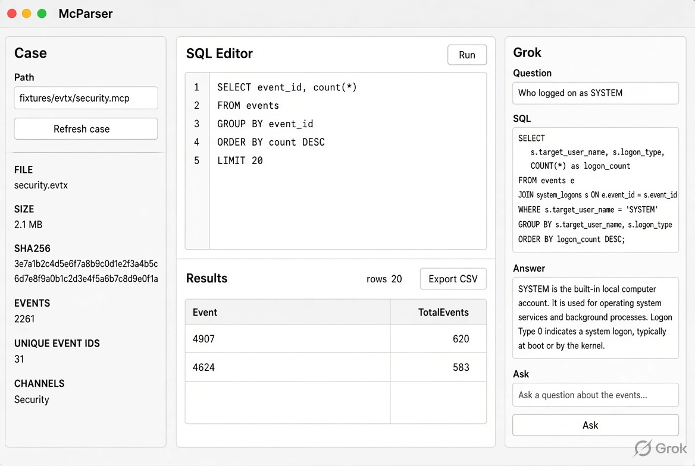
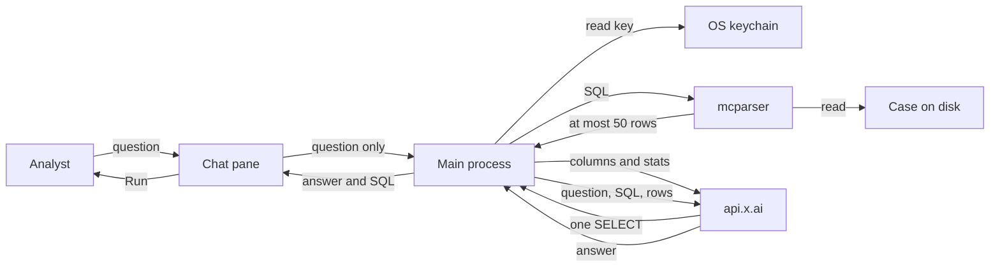

# Grok chat

Status: design only. Not in 0.1.0.

The chat is a pane in the desktop app. It writes SQL, McParser runs that SQL on the open case, and Grok answers from the returned rows. The `.evtx` file and the DuckDB file never leave the machine.

## Boundary

| Stays local | May be sent |
| --- | --- |
| `.evtx` bytes | The analyst's question |
| `events.duckdb` | Column names for the query |
| `catalog.sqlite` | At most 50 rows, cell text truncated |
| API key | The SQL that produced those rows |
| Case path | Case stats already shown in the sidebar: counts, channels, time range |

The renderer process never sees the key. The main process holds it and calls `https://api.x.ai`. The parser still runs as the local `mcparser` binary.

## Data flow

The case path never crosses to `api.x.ai`. The key never crosses to the chat pane. Run copies the SQL into the editor and queries the case again, locally, with no row cap.

## Key security

The key is the analyst's xAI key. McParser does not ship one, and it does not create one. A packaged build does not contain a key. A debug build does not read `XAI_API_KEY` or any other environment variable. There is no key in the repository, the installer, or the case directory.

### What we are protecting against

The threat is a copy of the key leaving the machine in a place the analyst did not choose: a case folder they hand to a colleague, a git commit, a log file, a crash report, the chat transcript, or the renderer process, which loads page content and is the easier process to inspect. We are not claiming the key is safe from someone who already controls the logged-in user account. The macOS keychain and Windows DPAPI both unlock for that user.

### Where it is entered

Paste happens in a settings sheet opened from the Grok menu. The field is a password field. The renderer sends the pasted value to the main process once, over the preload bridge, and then clears the field, including the undo stack for that control. The renderer does not keep a copy, and it does not write the paste into the chat transcript. The confirm dialog and every error string are written so they cannot include the key.

### What the window is allowed to know

IPC handlers never return the key. The renderer may ask only whether a key is set. The answer is a boolean and the last four characters, so the analyst can tell two keys apart. Replace and Forget are the other two calls. A handler that is not one of those three does not exist.

### How it is stored

The main process encrypts the key with Electron `safeStorage` before it touches disk. `safeStorage.encryptString` uses the macOS login keychain, or Windows DPAPI bound to the current user. The file in the app user-data directory is ciphertext plus a version byte. It is not in the case directory, the repository, a crash dump we write, or the chat transcript. The file mode is owner-read and owner-write. The path is not a case path, so ingest, export, and a copied `.mcp` folder cannot pick it up.

If `safeStorage` is unavailable, Save fails and nothing is written. We do not fall back to a plaintext file.

### How it is used

The plaintext exists in the main process only for the length of an API call. Decrypt, set the header, send, then drop the string. It is not passed as an argument to `mcparser`, and it is not written to stdout or stderr. The child process environment is the default environment with `XAI_API_KEY` removed if the analyst had one set.

The call is HTTPS to `api.x.ai` only. The host is fixed in the main process. A reply cannot change it. The key is the bearer token on that call and nowhere else. Certificate failure aborts the call. The key is not retried against another host.

### What is logged

Request logs, if added later, record status and elapsed time. They do not record the `Authorization` header, the request body, or the response body. A 401 is reported as "key rejected" and does not echo the key. DevTools in a packaged build is closed. A debug build may open DevTools, and the key still must not appear there.

### Replace and forget

Replace overwrites the ciphertext. Forget deletes the file and drops any plaintext still held. There is no export and no reveal. Closing the app drops the plaintext. No key, no chat. Ingest, query, and export do not change.

## Request path

1. The analyst asks in the chat pane.
2. The main process sends Grok the question plus the table columns and the sidebar stats. No rows yet.
3. Grok returns a single `SELECT`. The app rejects anything that is not one read statement: no `ATTACH`, no `COPY`, no `PRAGMA`, no second statement.
4. The local parser runs that SQL with a 50-row limit.
5. The main process sends the question, the SQL, and those rows. Cell values are truncated.
6. The reply is shown with the SQL. Run copies that SQL into the editor. The analyst can run it again and see every row.

The analyst confirms the first send of a session. The confirm dialog names the case and says that row text will leave the machine. It does not show the key. Later sends in that session do not ask again. Forget, or closing the case, resets the confirm.

## Menu

The menu bar gains a Grok menu, between Window and Help. File stays for opening a log. The key is not an About item.

- Connect Grok... opens the key sheet. The label becomes Grok connected when a key is stored, and the item stays enabled so the analyst can replace it.
- Forget key deletes the ciphertext. It is disabled until a key is stored.
- Show chat toggles the right-hand pane. The pane is hidden until a key is stored, then shown.

Connect Grok... is the only way in. The pane does not contain a second settings control. The sheet is a password field, Save, and Cancel. Forget stays on the menu so a key cannot be removed only from a pane that is itself hidden.

## UI

The studio stays as it is. A chat column opens on the right, same width as the case pane, after Connect Grok... succeeds.

- Header: Grok.
- Transcript: analyst questions, the SQL used, and the answer.
- Composer: one field and Ask.
- Empty state, no key: the pane is hidden. The Grok menu is the prompt.
- Empty state, key set: "Ask about this case."
- Key sheet, from the menu: password field, last four characters when a key is already set, Save, Cancel. Forget is the menu item.

The grid does not move. Ask does not change the editor until the analyst presses Run on a reply.

## Not in the first cut

Saved chats, agents, and a bot that runs while the analyst is away. Rendered message text. Sending the case file.
