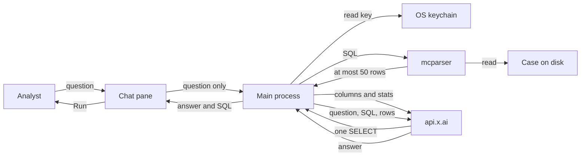

# Grok chat

Status: design only. Not in 0.1.0.

The chat is a pane in the desktop app. It writes SQL, McParser runs that SQL on the open case, and Grok answers from the returned rows. The `.evtx` file and the DuckDB file never leave the machine.

## Boundary

| Stays local | May be sent |
| --- | --- |
| `.evtx` bytes | The analyst's question |
| `events.duckdb` | Column names for the query |
| `catalog.sqlite` | At most 50 rows, cell text truncated |
| API key | The SQL that produced those rows |
| Case path | Case stats already shown in the sidebar: counts, channels, time range |

The renderer process never sees the key. The main process holds it and calls `https://api.x.ai`. The parser still runs as the local `mcparser` binary.

## Data flow

The case path never crosses to `api.x.ai`. The key never crosses to the chat pane. Run copies the SQL into the editor and queries the case again, locally, with no row cap.

## Key security

The key is the analyst's xAI key. McParser does not ship one. A packaged build does not contain a key. A debug build does not read `XAI_API_KEY` or any other environment variable.

Paste happens in a settings sheet. The renderer sends the pasted value to the main process once, over IPC, and then clears the field. The renderer does not keep a copy. IPC handlers never return the key. Settings can ask only "is a key set?" and receives the last four characters.

The main process encrypts the key with Electron `safeStorage` before it touches disk. On macOS that uses the login keychain. On Windows it uses DPAPI, bound to the current user. The file in the app user-data directory is ciphertext. It is not in the case directory, the repository, crash dumps we write, or the chat transcript.

The plaintext exists in the main process only for the length of an API call. It is not passed as an argument to `mcparser`. It is not written to stdout or stderr. Request logs, if added later, record status and elapsed time, not the `Authorization` header.

The call is HTTPS to `api.x.ai` only. The key is the bearer token on that call and nowhere else.

Replace overwrites the ciphertext. Forget deletes the file. There is no export. Closing the app drops the plaintext. No key, no chat. Ingest, query, and export do not change.

## Request path

1. The analyst asks in the chat pane.
2. The main process sends Grok the question plus the table columns and the sidebar stats. No rows yet.
3. Grok returns a single `SELECT`. The app rejects anything that is not one read statement: no `ATTACH`, no `COPY`, no `PRAGMA`, no second statement.
4. The local parser runs that SQL with a 50-row limit.
5. The main process sends the question, the SQL, and those rows. Cell values are truncated.
6. The reply is shown with the SQL. Run copies that SQL into the editor. The analyst can run it again and see every row.

The analyst confirms the first send of a session. The confirm dialog names the case and says that row text will leave the machine. It does not show the key. Later sends in that session do not ask again. Forget, or closing the case, resets the confirm.

## UI

The studio stays as it is. A chat column opens on the right, same width as the case pane.

- Header: Grok, and a settings control.
- Transcript: analyst questions, the SQL used, and the answer.
- Composer: one field and Ask.
- Empty state, no key: "Add an xAI key in Settings. The case stays on this machine."
- Empty state, key set: "Ask about this case."
- Settings sheet: key field, last four characters when set, Save, Replace, Forget.

The grid does not move. Ask does not change the editor until the analyst presses Run on a reply.

## Not in the first cut

Saved chats, agents, and a bot that runs while the analyst is away. Rendered message text. Sending the case file.
