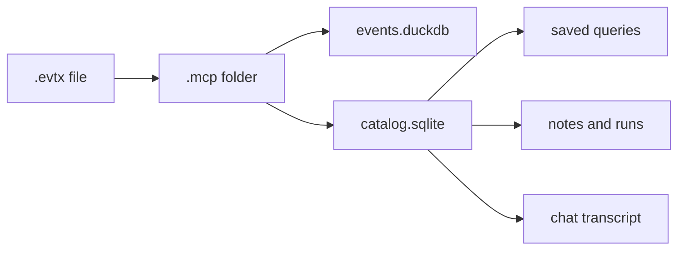

# The case

A case is a folder. McParser creates it beside the log you open, and it names the folder after that file, with `.mcp` on the end. If you opened `Security.evtx`, the folder is `Security.evtx.mcp`.

Two files live in that folder.

`events.duckdb` holds the events. Each row is one record from the log: the record id, the event id, the channel, the provider, the computer, the time, and a JSON object called `event_data`. The English sentence you would see in Event Viewer is not in this file. The fields are.

`catalog.sqlite` holds the work you did on those events. Saved queries, notes, the run trail, and the chat transcript all go here. The API key does not. The key stays in the keychain on the machine that asked the question.

If you copy the folder, you copy the events and the work. If you copy only the `.evtx` file, the other person starts again.

Treat the folder as the thing you keep. The window is only a way to look at it.
