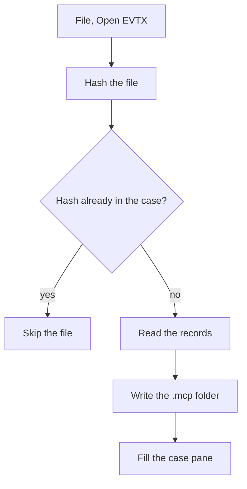

# Open a log

Choose File, then Open EVTX, and pick the log. McParser creates the case folder beside that file and reads the records into it. A Security log of a couple of thousand events takes a few seconds. A larger log takes longer. You can leave it. The window is not talking to a server.

When the read finishes, the case pane on the left fills in. You should see the path, the file name, the size, the SHA-256, the event count, the number of distinct event ids, the first and last time, the channels, and the providers. Those numbers are the check that you opened the file you meant to open. The sample Security log used in development has 2261 events. If you opened that file and the count is 2261, the read worked.

The left pane collapses. Case, Queries, and Hunts are separate lists so the column does not turn into one long scroll. Refresh case reads the folder again. Use it after you have copied a new file in, or after you have opened a handoff.

Opening the same bytes twice does not double the events. McParser hashes the file. If that hash is already in the catalog, the second open is skipped. If the path is the same and the hash has changed, the old rows for that path are replaced. A changed log is a new source, not a second copy of the old one.

