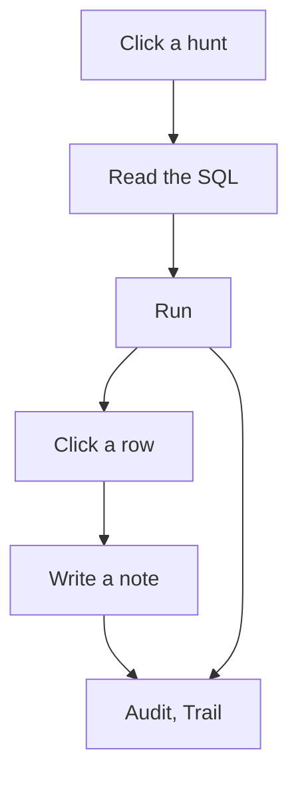

# Notes and the trail

A note is a sentence attached to a record. Click a row in the grid. The query that produced the row needs to include `record_id`, otherwise McParser does not know which record you mean. Write the sentence. The note remembers the SQL that was open, so a later reader can see how you reached that row.

Audit, then Notes, lists every note in the case.

A run is different. A run is written when you press Run and the statement succeeds. It stores the SQL, the time, the row count, the hunt label, the previous run, and the analyst name. Type your name in Analyst. It stays in the window, and it is written on the next run. A click in Audit, then Runs, loads that SQL again and marks the next run as a replay, so the trail does not look as if you performed the hunt twice.

Audit, then Trail, puts the notes and the runs on one list, in time order. Audit, then Export trail, writes `trail.csv`. A note saved before this feature existed has no time, so it sorts first until you save it again.

A query you run from the command line is not a run. Only the Run button writes the trail. If the trail is the record of the investigation, do that work in the window.
