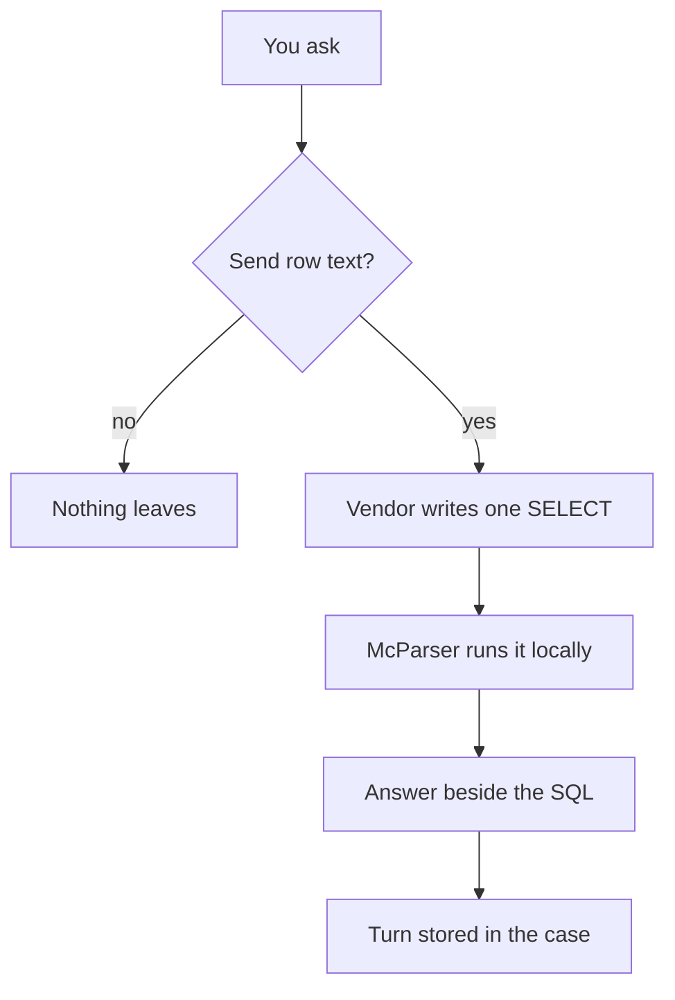

# Ask

The pane on the right can ask Grok, Claude, or OpenAI about the open case. Choose the vendor under AI Model. AI Integration, then Connect, saves that vendor's key. The key is encrypted with the macOS keychain or with Windows DPAPI, in its own file. It is not written into the case. A vendor with no key says to configure the integration, and no request is sent.

Ask in ordinary language. The vendor writes one SELECT. McParser runs that statement on the open case, keeps at most 50 rows, and shows the answer beside the SQL. The reply is prefixed with the vendor, so you can see who answered.

The first ask in a session asks you to confirm that row text will leave the machine. That confirmation is the point. The `.evtx` file and the DuckDB file stay here. The question, the column names, and up to 50 rows go out. If that is more than you want to send, do not confirm.

A completed ask is stored in the catalog: the question, the vendor, the SELECT, and the answer. Quit the window and open the same case. The pane shows the turn again, and it does not call the vendor to do it. A failed ask is not stored.

The other analyst can read that transcript from the case folder. They need their own key to ask a new question.
