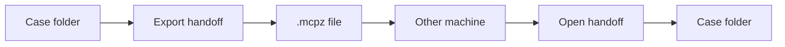

# Handoff

Copying the case folder is a handoff. The events, the saved queries, the notes, the runs, and the transcript are in the folder. The key is not. That copy is readable by anyone who has the folder.

File, then Export handoff, is the locked copy. McParser asks where to save the file, then asks for a password of at least eight characters. The file ends in `.mcpz`. The password is not stored. If you lose it, the file cannot be opened. There is no recovery and no account that can reset it.

On the other machine, choose File, then Open handoff. Pick the file, enter the password, and choose a folder to unpack into. The button says Decrypt. A wrong password stops and says the password was rejected. It does not start the file picker again.

Give the password to the other analyst by a path you already trust. The file can go on a disk or in a mail message. The password should not go in the same message.

Open the unpacked folder and check one thing you expect to see, such as a note or a chat turn. If that is there, the handoff worked.
