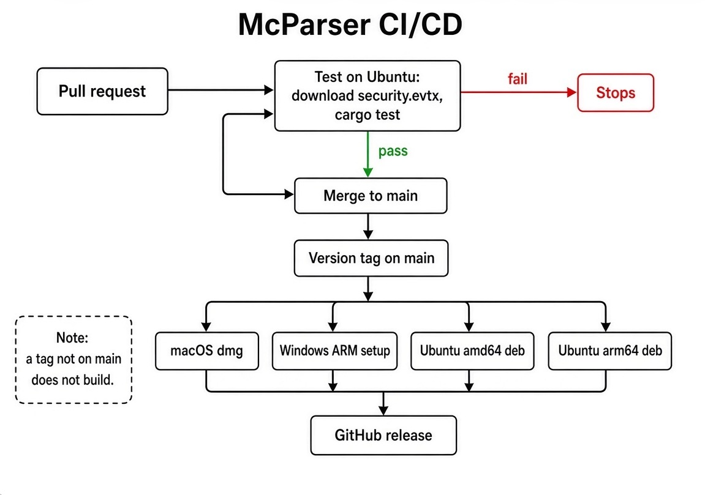

# How a change gets to a release

A change starts as a pull request. The Ubuntu runner downloads the Security sample and runs the parser tests. If a count is wrong, the job stops. The pull request does not merge, and no installer is built.

A green test is the permission to merge. `main` is the branch that has already passed.

A release is a version tag on that branch. The same tests run again. If they pass, four packages are built and attached to the release: the Mac disk image, the Windows ARM setup, and the Ubuntu packages for amd64 and arm64. A tag that is not on `main` does not build.

The window is not part of this job. The tests lock the parser: the help page, the fixture counts, a saved query, a note, a run, a chat turn, and a handoff that rejects a bad password.
